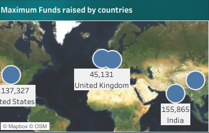
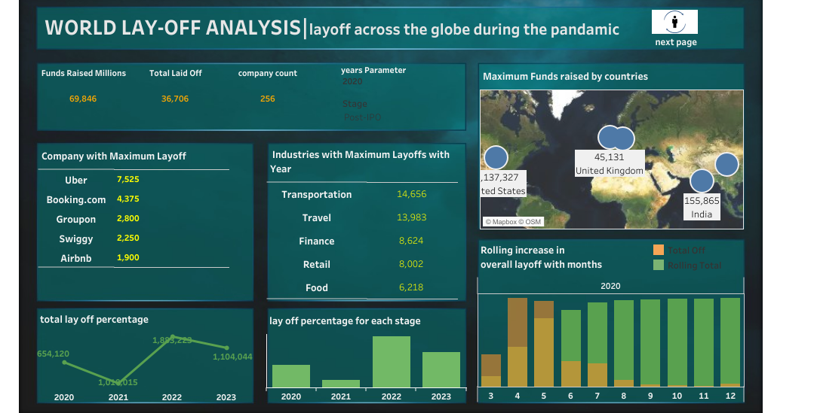
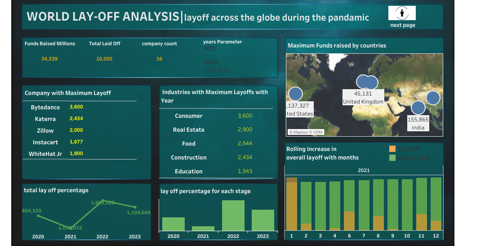
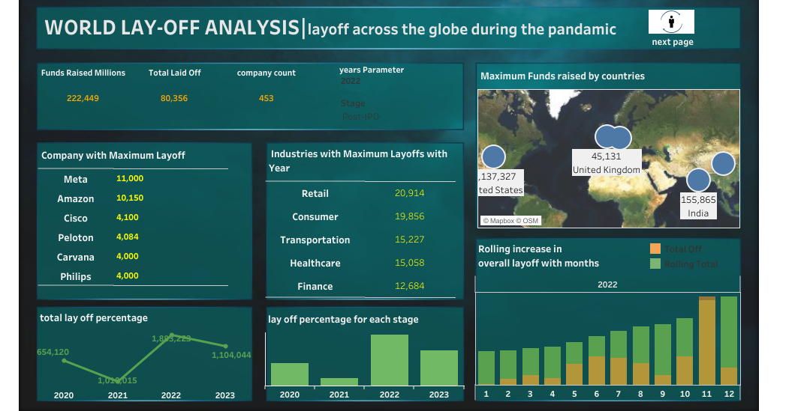
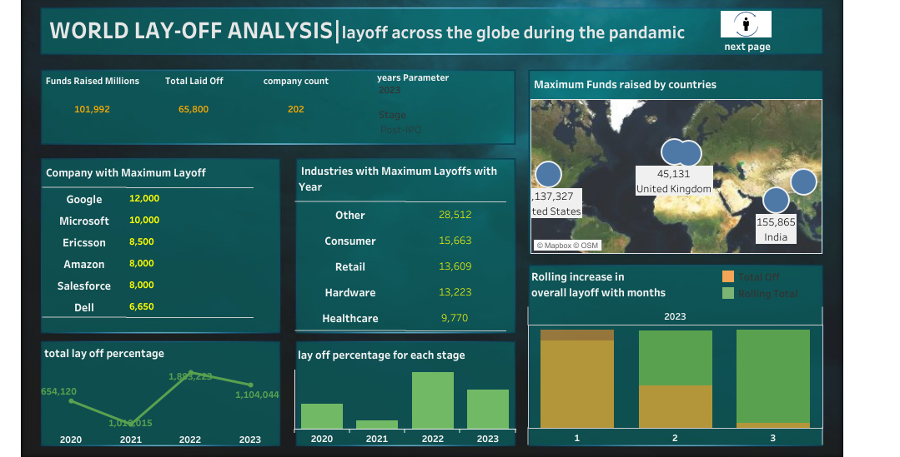
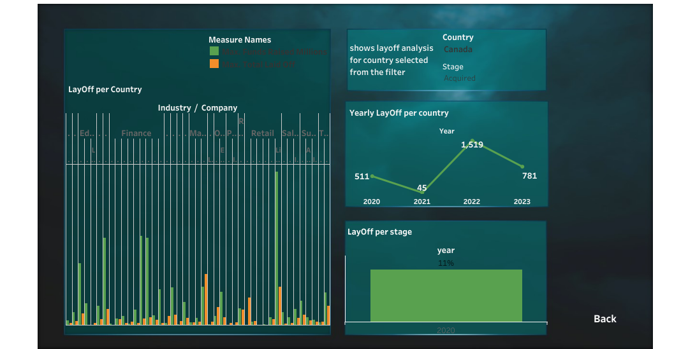

# Exploratory Data Analysis: Layoff Insights

## Introduction

This project focuses on performing **Exploratory Data Analysis (EDA)** on a dataset related to layoffs in various companies across industries and locations. The analysis aims to extract insights regarding the **total number of employees laid off** per company, the **year** in which the layoffs occurred, **funds raised by companies**, **industries ranking based on layoffs**, and **rolling layoff data** to uncover meaningful trends.

### Dataset Overview

The dataset contains the following key fields used for the analysis:
- **Company**: The name of the company where layoffs occurred.
- **Location**: The geographic location of the company.
- **Industry**: The business sector to which the company belongs.
- **Total Laid Off**: The total number of employees laid off by each company.
- **Percentage Laid Off**: The percentage of the company's workforce affected by the layoffs.
- **Year**: The year in which the layoffs took place.
- **Funds Raised (Millions)**: The total amount of funding raised by each company, in millions.

### Project Goals

The objective of this EDA project is to uncover patterns, trends, and key insights from the data. Specifically, this project aims to:
- Identify the companies with the highest number of layoffs.
- Analyze the distribution of layoffs across years.
- Rank industries based on layoffs.
- Examine the relationship between the funds raised and layoffs.
- Perform a rolling analysis to visualize the trend of layoffs over time.
- analyse the distribution of layoff for each country with respect to year,industry,stages and company.

### Tools and Techniques

This analysis is carried out using the following tools:
- **Tableau**: For data manipulation, analysis, and visualization.
- **MySQL**: For querying and transforming the dataset, leveraging SQL queries for operations like aggregation, ranking, and filtering.
  
### Insights

#### 1. Companies with the Most Layoffs

The following table shows the **top 5 companies** with the highest layoffs for each year from **2020 to 2023**. The companies are ranked based on the total number of employees laid off.

#### Layoff Rankings in 2020
| Rank | Company       | Total Laid Off | Year |
|------|---------------|----------------|------|
| 1    | Uber          | 7,525          | 2020 |
| 2    | Booking.com   | 4,375          | 2020 |
| 3    | Groupon       | 2,800          | 2020 |
| 4    | Swiggy        | 2,250          | 2020 |
| 5    | Airbnb        | 1,900          | 2020 |

#### Layoff Rankings in 2021
| Rank | Company       | Total Laid Off | Year |
|------|---------------|----------------|------|
| 1    | Bytedance     | 3,600          | 2021 |
| 2    | Katerra       | 2,434          | 2021 |
| 3    | Zillow        | 2,000          | 2021 |
| 4    | Instacart     | 1,877          | 2021 |
| 5    | WhiteHat Jr   | 1,800          | 2021 |

#### Layoff Rankings in 2022
| Rank | Company       | Total Laid Off | Year |
|------|---------------|----------------|------|
| 1    | Meta          | 11,000         | 2022 |
| 2    | Amazon        | 10,150         | 2022 |
| 3    | Cisco         | 4,100          | 2022 |
| 4    | Peloton       | 4,084          | 2022 |
| 5    | Carvana       | 4,000          | 2022 |
| 5    | Philips       | 4,000          | 2022 |

#### Layoff Rankings in 2023
| Rank | Company       | Total Laid Off | Year |
|------|---------------|----------------|------|
| 1    | Google        | 12,000         | 2023 |
| 2    | Microsoft     | 10,000         | 2023 |
| 3    | Ericsson      | 8,500          | 2023 |
| 4    | Amazon        | 8,000          | 2023 |
| 4    | Salesforce    | 8,000          | 2023 |
| 5    | Dell          | 6,650          | 2023 |

This table outlines the top layoffs in companies across industries between 2020 and 2023, with **Uber** leading the layoffs in 2020, **Bytedance** in 2021, **Meta** in 2022, and **Google** in 2023. Each ranking highlights the companies that have undergone major workforce reductions in their respective years.

#### 2. Layoffs by Year

The layoffs have been distributed across several years. Here is a breakdown of the total layoffs for key years:

| Year  | Total Laid Off |
|-------|----------------|
| 2020  | 36,706       |
| 2021  | 10.005        |
| 2022  | 80,356         |
| 2023  | 65,800         |

### 3. Total Funds Raised by Country

This table summarizes the **total funds raised** by companies in various countries, showing the dominance of the United States in terms of capital raised.

| Country        | Total Funds Raised (in millions) |
|----------------|----------------------------------|
| United States  | 1,137,327                        |
| India          | 155,865                          |
| China          | 49,997                           |
| Germany        | 46,151                           |

 **total funds raised by top countries**  
     

   
### 4. Industry Layoff Analysis (2020 - 2023)

### Industry Layoffs by Year and Ranking

The following table shows the **top 5 industries** with the highest layoffs for each year from **2020 to 2023**. The industries are ranked based on the total number of employees laid off.

### Layoff Rankings in 2020
| Rank | Industry       | Total Laid Off | Year |
|------|----------------|----------------|------|
| 1    | Transportation  | 14,656         | 2020 |
| 2    | Travel          | 13,983         | 2020 |
| 3    | Finance         | 8,624          | 2020 |
| 4    | Retail          | 8,002          | 2020 |
| 5    | Food            | 6,218          | 2020 |

### Layoff Rankings in 2021
| Rank | Industry       | Total Laid Off | Year |
|------|----------------|----------------|------|
| 1    | Consumer        | 3,600          | 2021 |
| 2    | Real Estate     | 2,900          | 2021 |
| 3    | Food            | 2,644          | 2021 |
| 4    | Construction    | 2,434          | 2021 |
| 5    | Education       | 1,943          | 2021 |

### Layoff Rankings in 2022
| Rank | Industry       | Total Laid Off | Year |
|------|----------------|----------------|------|
| 1    | Retail          | 20,914         | 2022 |
| 2    | Consumer        | 19,856         | 2022 |
| 3    | Transportation  | 15,227         | 2022 |
| 4    | Healthcare      | 15,058         | 2022 |
| 5    | Finance         | 12,684         | 2022 |

### Layoff Rankings in 2023
| Rank | Industry       | Total Laid Off | Year |
|------|----------------|----------------|------|
| 1    | Other           | 28,512         | 2023 |
| 2    | Consumer        | 15,663         | 2023 |
| 3    | Retail          | 13,609         | 2023 |
| 4    | Hardware        | 13,223         | 2023 |
| 5    | Healthcare      | 9,770          | 2023 |

## Visualizations

You can view the visualizations below for the rankings and layoff insights.

1. **Layoffs by Industry and company  in 2020**  
   
   
2. **Layoffs by Industry and company in 2021**  
   
   
3. **Layoffs by Industry  and company in 2022**  
   
   
4. **Layoffs by Industry and company  in 2023**  
   

---

This table outlines the top layoffs in various industries between 2020 and 2023, with **Transportation** leading the layoffs in 2020, **Consumer** in 2021, **Retail** in 2022, and **Other** in 2023. Each ranking highlights the industries that have undergone significant workforce reductions in their respective years.

### 5. Rolling Analysis of Layoff Data

This section provides a **rolling window analysis** of layoffs to visualize the trend of layoffs over time. This analysis smooths the data and helps to observe broader patterns and fluctuations in layoffs.

> **SQL Query for rollind data analysis**:
> 
##### with rolling_total as 
 ##### (
##### select substring(`date`,1,7) as `month` , sum(total_laid_off) as total_off from layoffs_stagging_2 where substring(`date`,1,7) is ##### not null

 ##### group by month
##### order by month asc
##### )
##### select  `month` ,total_off,sum(total_off) over(order by `month`)  as rolling_total  from rolling_total; #####

rolling lay -off data fetched through the above query

- **Rolling lay off trend with year**: [[Link to rolling data trend ](https://github.com/NandhiniKumar12/EDA-project_layoff-across-the-world-during-the-pandamic/blob/main/rolling_layoff_year.csv)]

### 6.Lay-off Analysis for each country 

This section provides a deep insight into the company, industry,maximum layoff done and fundesraised for each **country** over time  
**Layoffs analysis for each country over time**  
**Layoffs by Industry and company  in 2023**  
   

### Project Files

- **Uncleaned Dataset**: [Link to Uncleaned Data](https://github.com/NandhiniKumar12/EDA-project_layoff-across-the-world-during-the-pandamic/blob/main/lay0ff_EDA.sql)]
- **Cleaned Dataset**: [[Link to Cleaned Data](https://github.com/NandhiniKumar12/EDA-project_layoff-across-the-world-during-the-pandamic/blob/main/cleaned%20data_layoff.csv)]
- **SQL Queries**:
  - [Funds Raised vs Layoffs Query](#)
  
### Conclusion

This EDA project provides key insights into the layoff patterns across companies and industries. Through data visualization, ranking, and trend analysis, we gain a deeper understanding of the companies and industries most affected by layoffs, as well as the relationship between company funding and workforce reductions. Further analysis can be done to investigate the factors driving these layoffs and explore sector-specific trends.

---

Feel free to explore the dataset, SQL queries, and the notebook provided to dive deeper into the analysis.
